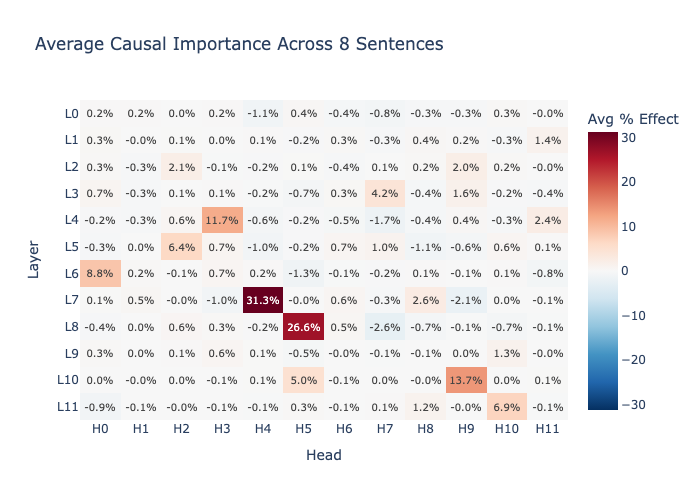
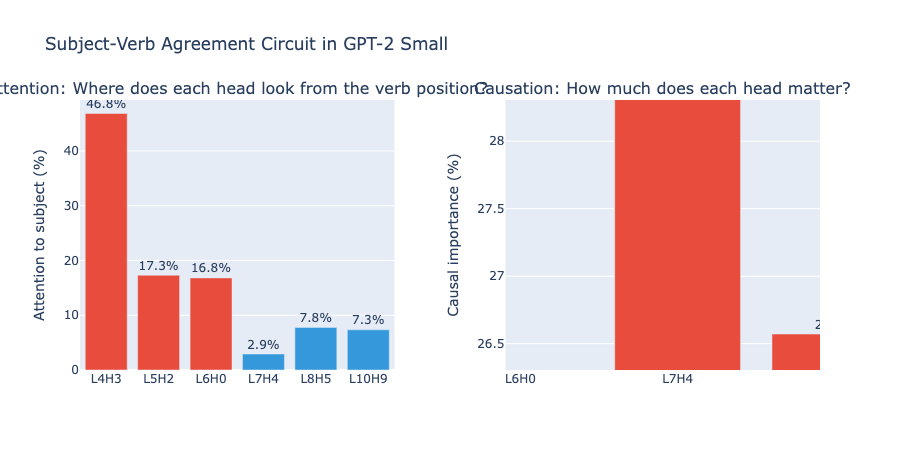
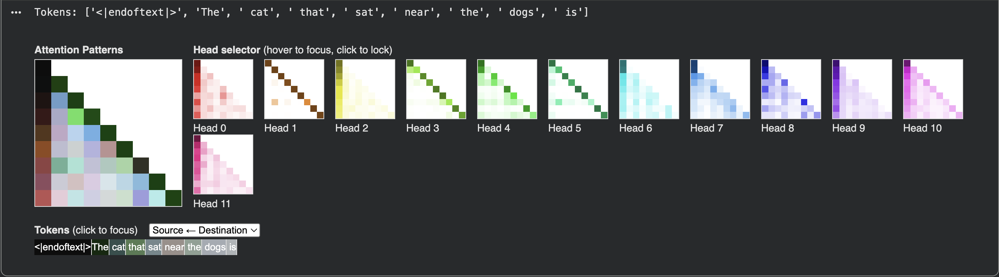

# Dissecting Subject-Verb Agreement in GPT-2 Small: A Mechanistic Interpretability Study

How does a language model know that "The cat that sat near the dogs **is**" requires a singular verb? This project opens up GPT-2 Small and identifies the specific attention heads responsible for subject-verb number agreement — showing that just 4 out of 144 heads account for 83% of the model's ability to match verbs to their grammatical subjects.

## Key Findings

### The Circuit

We identified a sparse, functionally specialized circuit for subject-verb agreement:

| Head      | Role                     | Causal Effect | Behavior                                                                        |
| --------- | ------------------------ | ------------- | ------------------------------------------------------------------------------- |
| **L4H3**  | Subject Detector         | 11.7%         | Attends from verb → subject noun with 30–60% weight, ignoring distractors (~0%) |
| **L7H4**  | Primary Decision Maker   | 31.3%         | Reads processed representations; pushes output toward correct verb form         |
| **L8H5**  | Secondary Decision Maker | 26.6%         | Reinforces L7H4's signal through a parallel pathway                             |
| **L10H9** | Late Refinement          | 13.7%         | Final-stage adjustment before the unembedding layer                             |


_Causal effect of all 144 attention heads on subject-verb agreement, averaged across 8 test sentences (Section 6). L7H4, L8H5, L10H9, and L4H3 stand out as the dominant contributors._

### Attention ≠ Importance

One of the most striking findings: **the head that looks at the subject most is not the head that matters most.**

- L4H3 puts 46.8% of its attention on the subject — but contributes only 11.7% of the causal effect.
- L7H4 puts just 2.9% of its attention on the subject — yet contributes 31.3% of the causal effect.

This happens because L7H4 doesn't need to look at the subject directly. Earlier heads (L4H3) have already written subject-number information into the residual stream. L7H4 reads that processed information from structural positions like relative pronouns and prepositions, then translates it into the correct verb prediction. Information flows through the residual stream, not through direct token-to-token attention.


_Side-by-side comparison (Section 8): attention paid to the subject vs. actual causal importance for each key head. L4H3 dominates attention; L7H4 dominates causation._

### Sparsity

Out of 144 total attention heads, 140 contribute less than 5% each. The model concentrates subject-verb agreement into a tiny, specialized sub-network rather than distributing it diffusely.


_CircuitsVis attention pattern visualization for one of the key subject-tracking heads (Section 2/3)._

## Methodology

### Task Design

We use sentences with **agreement attractors** — plural nouns placed between a singular subject and its verb to test whether the model can resist distraction:

```
"The cat that sat near the dogs ___"  → should predict "is" (singular, matching "cat")
                                       → NOT "are" (plural, matching "dogs")
```

### Techniques Used

1. **Attention Pattern Analysis**: Directly inspecting where each attention head "looks" from the verb position across 8 test sentences with varying structures.

2. **Activation Patching (Causal Intervention)**: For each of the 144 heads, we replace its activations on the clean input with activations from a corrupted input (where subject and distractor are swapped) and measure the change in the model's preference for singular vs. plural verbs. This establishes **causal** importance, not just correlation.

3. **Residual Stream Analysis**: Investigating what the decision-maker heads attend to, revealing a two-stage pipeline where early heads write to and late heads read from the residual stream.

### Test Sentences

| Clean (singular subject)            | Corrupted (swapped)                 |
| ----------------------------------- | ----------------------------------- |
| The cat that sat near the dogs      | The dogs that sat near the cat      |
| The dog that chased the cats        | The cats that chased the dog        |
| The boy who talked to the girls     | The girls who talked to the boy     |
| The key to the cabinets             | The cabinets to the key             |
| The bird that flew over the houses  | The houses that flew over the bird  |
| The price of the tickets            | The tickets of the price            |
| The teacher who helped the students | The students who helped the teacher |
| The leader of the groups            | The groups of the leader            |

## Project Structure

```
├── README.md
├── mech_interp_subject_verb_agreement.ipynb   # Full notebook with all experiments
├── figures/
│   ├── causal_heatmap.png                     # 12×12 head importance heatmap
│   ├── attention_vs_causation.png             # Side-by-side comparison chart
│   └── attention_patterns.png                 # Attention visualizations
└── requirements.txt
```

## Reproducing the Results

### Requirements

```
transformer_lens
circuitsvis
plotly
torch
numpy
```

### Quick Start

```bash
pip install transformer_lens circuitsvis plotly

# Open the notebook in Google Colab or Jupyter
jupyter notebook mech_interp_subject_verb_agreement.ipynb
```

The full analysis runs on Google Colab's free tier (GPT-2 Small fits easily in memory). The multi-sentence causal patching takes approximately 3-5 minutes.

## Tools & References

### Tools

- [TransformerLens](https://github.com/TransformerLensOrg/TransformerLens) — Neel Nanda's library for mechanistic interpretability of GPT-style models
- [CircuitsVis](https://github.com/alan-cooney/CircuitsVis) — Interactive attention pattern visualization

### Related Work

- Elhage et al., ["A Mathematical Framework for Transformer Circuits"](https://transformer-circuits.pub/2021/framework/index.html) (Anthropic, 2021)
- Nanda, ["200 Concrete Open Problems in Mechanistic Interpretability"](https://www.alignmentforum.org/posts/LbrPTJ4fmABEdEnLf/200-concrete-open-problems-in-mechanistic-interpretability) (2022)
- Goldstein et al., ["Does GPT-2 Know Your Phone Number?"](https://arxiv.org/abs/2310.02207) — related work on information localization in transformers

## Author

**Heval Söğüt**
Computer Engineering Student | AI & Automation Engineer

- GitHub: [@hevalsogut](https://github.com/hevalsogut)
- LinkedIn: [hevalsogut](https://linkedin.com/in/hevalsogut)

## License

This project is licensed under the [MIT License](LICENSE) — feel free to use, cite, or build upon this work.
